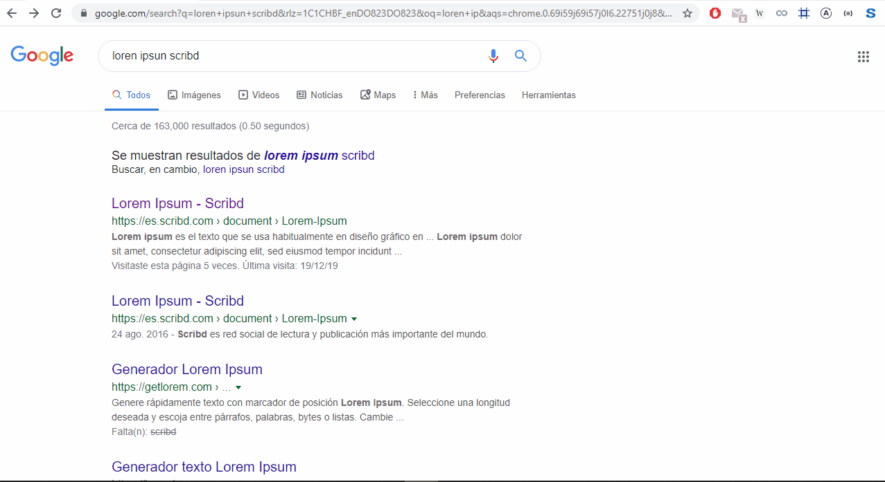

# scribdStrip

Chrome extension for revealing pages content without subscribing.

# Use

Just click the 'S' button on chrome bar to reveal the pages in front of you.

# Supported sites

 - scribd.com/docs
 - studocu.com

# Contribute

If you want to fork and improve or modify something, please leave a comment [here](https://github.com/noGreg/scribdStrip/issues/1) about it 🙏

**You can also [sponsor the project ⭐](https://www.patreon.com/abax_)**

# Chrome store

In case that you want to [see|test|use] the extension as a quick here is the link to the [Chrome extension](https://chrome.google.com/webstore/detail/scribd-pages-reveal/pjdpilmkgoodplhgpohdfpmgajmnkiek)
